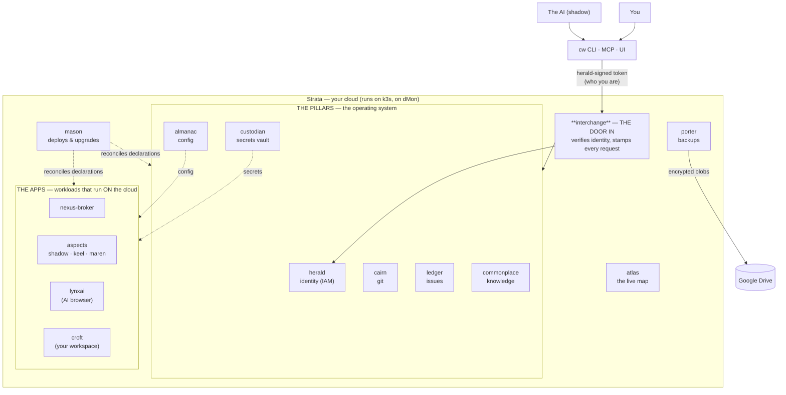

# Strata — how it all hangs together

A picture for the human owner. *Logical* knowing (the parts) and *visual*
knowing (the shape) are different — this is the shape. Renders on GitHub.

## The cloud as a stack with a door

## Read it bottom-up

1. **dMon** — your physical machine (CPU + RTX 5090 GPU).
2. **k3s** — a single-node Kubernetes on dMon; runs everything above as pods.
3. **The pillars** — the "OS" of your cloud, each one small service:
   herald (*who you are*), almanac (*how it's configured*),
   custodian (*the secrets*), cairn (*git*), ledger (*work*),
   commonplace (*knowledge*). They talk gRPC-over-mTLS inside a private mesh.
4. **interchange** — the single door in. Everything from outside enters here;
   it checks your herald identity and stamps every request.
5. **The apps** — what runs *on* the cloud: the nexus-broker, the AI aspects,
   lynxai (the AI's browser), croft (your workspace, where the AI lives).
6. **Cross-cutting:** **mason** deploys & upgrades (declarations → running pods),
   **casket** encrypts every secret everywhere, **porter** snapshots the whole
   thing to Google Drive (encrypted), and the whole stack pulls **digest-pinned
   images from GHCR** so a reboot is never a surprise upgrade.

## The one-sentence version

> dMon runs k3s; k3s runs the pillars and your apps; herald says who you are,
> almanac how things are configured, custodian holds the secrets, mason makes
> the apps real, interchange is the door in, porter backs it all up — with
> casket encrypting throughout.

## The live version

This static map is for *understanding the shape*. The **live** version is
**atlas** — https://atlas.tail41686e.ts.net (herald login): the running cloud
drawn as namespace regions (CWB the platform on the left; nexus and croft as
tenant consumers on the right), every workload lit by real state — up /
degraded / down / dormant-on-purpose, the version actually running, mason's
sync phase, and porter's backup clock. Same read-only state is available to
machines at the edge: `GET /atlas/api/strata/state`.

**Comprehension before operation:** the CLI/MCP operate; the map lets you
*see*. The map's detail panel reserves the spot where operating verbs land
next — the window becomes the door to the cockpit.
